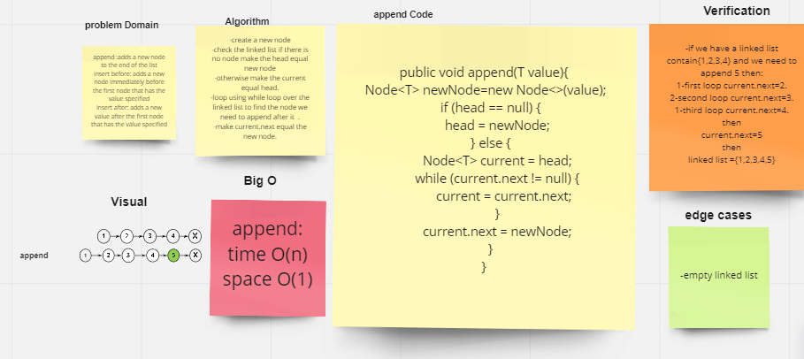
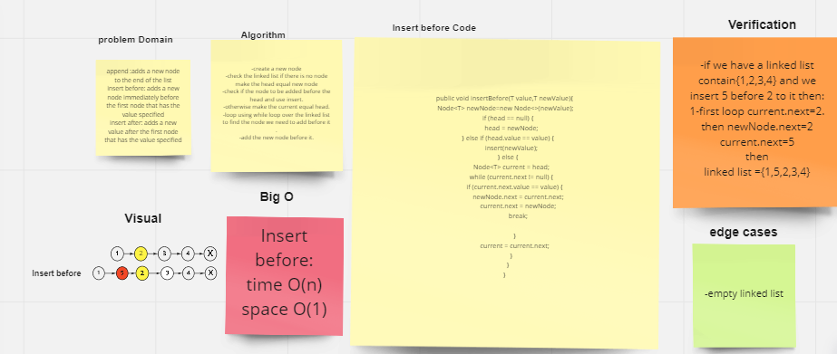
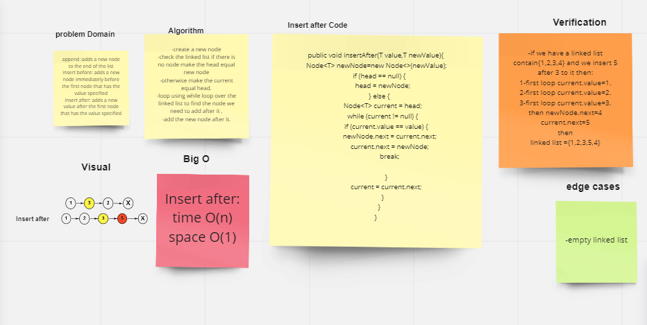
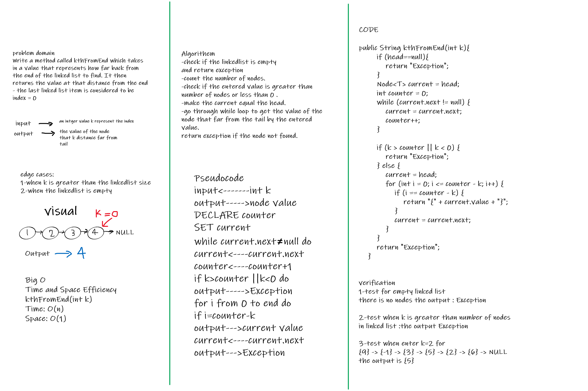
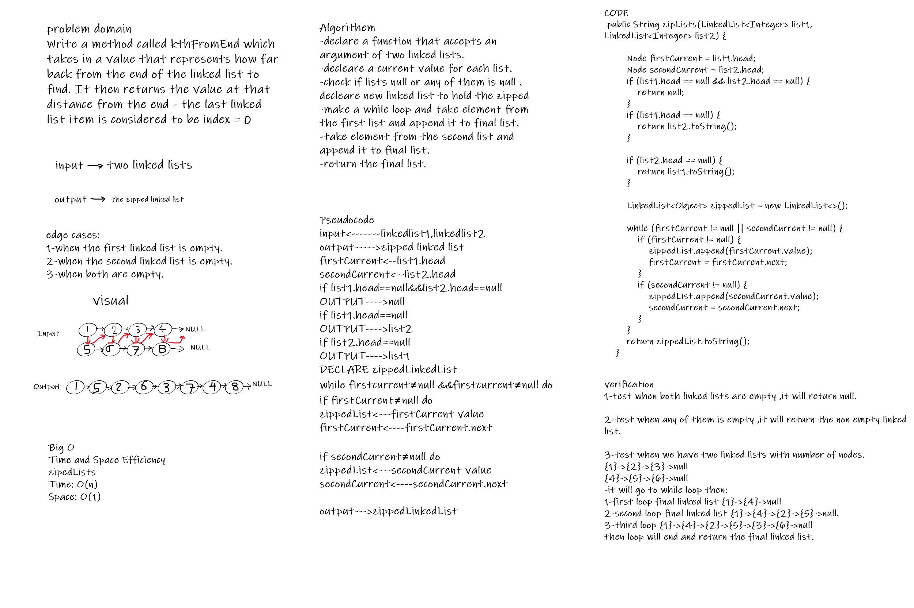

# Singly Linked List
<!-- Short summary or background information -->
Singly refers to the number of references the node has. A Singly linked list means that there is only one reference, and the reference points to the Next node in a linked list.

## Challenge
<!-- Description of the challenge -->
Create  Node class to use it inside the linked list class which contain number of methods that can do insert a value to the linked list or check if it contain a certain value and print out the values in the linked list as well.

## Whiteboard Process
<!-- Embedded whiteboard image -->
The append method

The insertBefore method

The insertAfter method

The kthFromEnd method

The zipLists method

## Approach & Efficiency
<!-- What approach did you take? Why? What is the Big O space/time for this approach? -->
I use the while() loop. This allows me to continually check that the Next node in the list is not null.

Time : O(n). Space : O(1).

### code chalenge 6

In lab 06 I use the while() loop. and If statments to know the node to be insert before it or after it.
Time : O(n). Space : O(1). for all the functions.

### code chalenge 7

The method kthFromEnd(int k) will use a int Count to store the length of linked list using while loop,then use a current.next != null inside another while loop to get the value of the wanted node. After the completion of the while loop  If this loop does not produce the correct result, it will return Exception.
Time and Space Efficiency
kthFromEnd(int k)
Time: O(n)
Space: O(1)

### code chalenge 8

Zip the two linked lists together into one so that the nodes alternate between the two lists and return a reference to the head of the zipped list.

zipLists(LinkedList list1,LinkedList list2)
Time and Space Efficiency
Time: O(n)
Space: O(1)

## API
<!-- Description of each method publicly available to your Linked List -->
### Insert

which take a value as Argument and returns nothing,it
adds a new node with that value to the head of the linked list with an O(1) Time performance.

### includes

which take a value as Argument and returns boolean true or false,It indicates whether that value exists as a Node’s value somewhere within the list.

### to string

It returns a string representing all the values in the Linked List, formatted as:
"{ a } -> { b } -> { c } -> NULL".

### append

It takes a new value and adds a new node with the given value to the end of the list.

### insert before

It take a value, new value and adds a new node with the given new value immediately before the first node that has the value specified.

### insert after

It take a value, new value and its adds a new node with the given new value immediately after the first node that has the value specified.

### kthFromEnd

Write a method called kthFromEnd which takes in a value that represents how far back from the end of the linked list to find. It then returns the value at that distance from the end - the last linked list item is considered to be index = 0

### zipLists

Write a function called zip lists which take 2 linked lists as Arguments and returns LinkedList zipped.