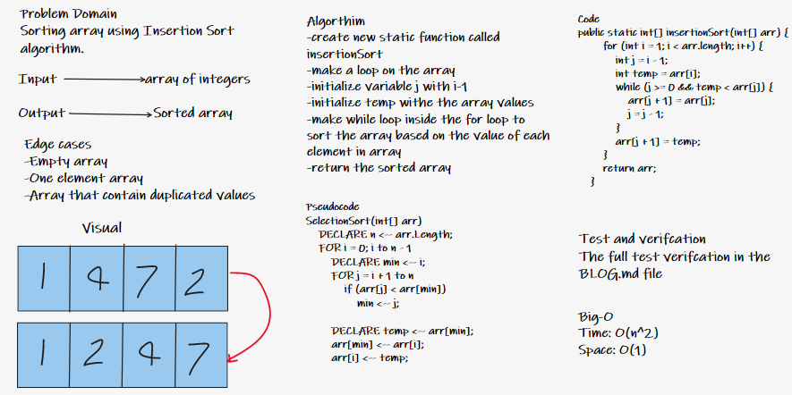
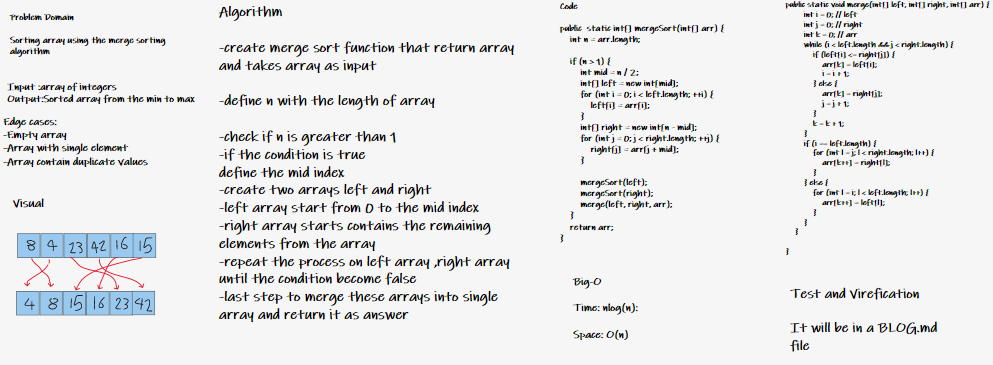
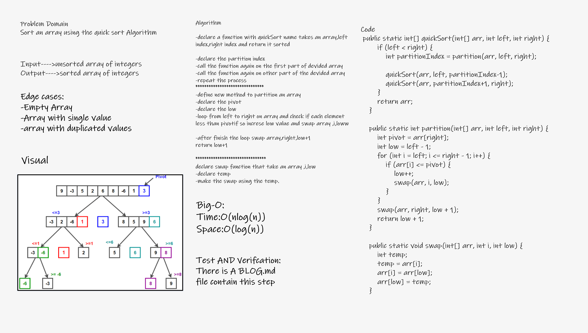

# Challenge Summary
<!-- Description of the challenge -->

## Code Challenge

### Code challenge #26

This challange is about sorting an array using Insertion Sort algorithm.You need to review the pseudocode , then trace the algorithm.

### Code challenge #27

This challange is about sorting an array using merge Sort algorithm.
Review the pseudocode , then trace the algorithm by stepping through the process with the provided sample array.

### Code challenge #28

This challange is about sorting an array using quick Sort algorithm.
Review the pseudocode , then trace the algorithm by stepping through the process with the provided sample array.

--------

## Whiteboard Process
<!-- Embedded whiteboard image -->

### Insertion Sort

[Insertion Sort BLOG.md](BLOG.md)

### Approach & Efficiency
<!-- What approach did you take? Why? What is the Big O space/time for this approach? -->

The insertion sort is a sorting method which is most effective on an array of limited size. This sort compares an element within the array to the next value and checks to see if it is greater than that element and moves the current element to the checked elements position (if the checked element is less than the current).

Time and Space:

Time: O(n^2)

Space: O(1)

--------

### merge sort

[merge Sort BLOG.md](sorting/mergeSortBLOG.md)

## Approach & Efficiency for merge sort
<!-- What approach did you take? Why? What is the Big O space/time for this approach? -->

Merge Sort is a Divide and Conquer algorithm. It divides the input array into two halves, calls itself for the two halves, and then merges the two sorted halves.

Time and Space:

Time: nlog(n)

Space: O(n)

--------

### Quick sort

[quick Sort BLOG.md](sorting/quickSortBLOG.md)

## Approach & Efficiency for quick sort
<!-- What approach did you take? Why? What is the Big O space/time for this approach? -->

QuickSort is a Divide and Conquer algorithm. It picks an element as pivot and partitions the given array around the picked pivot.

Time and Space:

Time: O(n log(n))

Space: O(log(n))

## Solution
<!-- Show how to run your code, and examples of it in action -->
[insertion sort](app/src/main/java/sorting/App.java)

[insertion sort Test](app/src/test/java/sorting/AppTest.java)

How to run the App:
Clone the repo from GitHub and open the project folder inside your IDE then open file.then build it ,you can run the app by `./gradlew` run,and run the test by `./gradlew` test.
