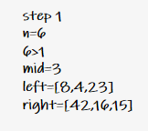
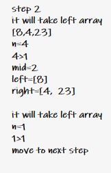
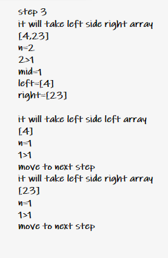
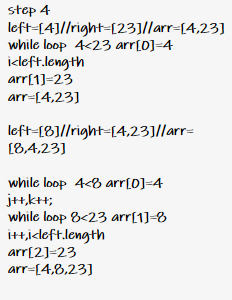
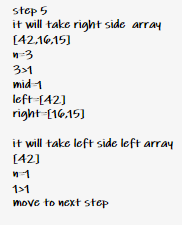
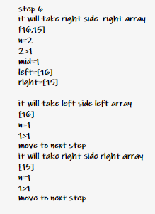
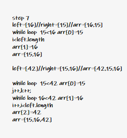
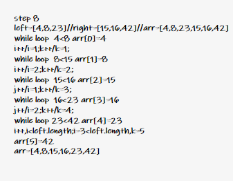

# Merge Sort

Merge Sort is a Divide and Conquer algorithm. It divides the input array into two halves, calls itself for the two halves, and then merges the two sorted halves. The merge() function is used for merging two halves. The merge(arr, l, m, r) is a key process that assumes that arr[l..m] and arr[m+1..r] are sorted and merges the two sorted sub-arrays into one. See the following C implementation for details.

MergeSort(arr[], l,  r)
If r > l

1. Find the middle point to divide the array into two halves:  
   middle m = l+ (r-l)/2
2. Call mergeSort for first half:
   Call mergeSort(arr, l, m)
3. Call mergeSort for second half:
   Call mergeSort(arr, m+1, r)
4. Merge the two halves sorted in step 2 and 3:
   Call merge(arr, l, m, r)

## Pseudocode

```java
ALGORITHM Mergesort(arr)
    DECLARE n <-- arr.length
    if n > 1
      DECLARE mid <-- n/2
      DECLARE left <-- arr[0...mid]
      DECLARE right <-- arr[mid...n]
      // sort the left side
      Mergesort(left)
      // sort the right side
      Mergesort(right)
      // merge the sorted left and right sides together
      Merge(left, right, arr)
ALGORITHM Merge(left, right, arr)
    DECLARE i <-- 0
    DECLARE j <-- 0
    DECLARE k <-- 0
    while i < left.length && j < right.length
        if left[i] <= right[j]
            arr[k] <-- left[i]
            i <-- i + 1
        else
            arr[k] <-- right[j]
            j <-- j + 1
        k <-- k + 1
    if i = left.length
       set remaining entries in arr to remaining values in right
    else
       set remaining entries in arr to remaining values in left
```

## Trace

Sample Array: [8,4,23,42,16,15]

**First step:**

will declare n equal to arr.length and if it grater than 1 will divide the array and assign it in the new 2 arrays.

left => [8,4,23]

Right => [42,16,15]



**second step:**

will recall the function in the left side of the array [8,4,23],divide it to also left and right.

left => [8]

Right => [4,23]

than recall the the function in the left side of it [8]. and because it length is not grater than 1 will move to next step.



**Third step:**

will recall the function in the right side of the array [4,23]. and because it length is grater than 1 will divide it to left [4] and right [23], then call the function for the left [4] array and because it length is not grater than 1 will move to next step. and call the function for the right [23] array.and because it length is not grater than 1 will move to next step.



**Fourth step:**

Will call the marge function the right array of the left array [4, 23]. then compare the values and re-assign the values from less to greatest in the array.

then Will call the marge function the left array main array [8, 4, 23]. then compare the values and re-assign the values from less to greatest in the array.

the result a sorted left part of the main array [4,8,23].



**Fifth step:**

will recall the function in the right side of the array [42, 16, 15],divide it to also left and right.

left => [42]

Right => [16,15]

than recall the the function in the left side of it [42]. and because it length is not grater than 1 will move to next step.



**sixth step:**

will recall the function in the right side of the array [16,15]. and because it length is grater than 1 will divide it to left [16] and right [15], then call the function for the left [16] array and because it length is not grater than 1 will move to next step. and call the function for the right [15] array.and because it length is not grater than 1 will move to next step.



**seventh step:**

Will call the marge function the right array of the right array [16,15]. then compare the values and re-assign the values from less to greatest in the array.

then Will call the marge function the right array of main array [42,15,16]. then compare the values and re-assign the values from less to greatest in the array.

the result a sorted right part of the main array [15,16,42].



**eighth step:**

Will call the marge function the main array [8,4,23,42,16,15]. then compare the values and re-assign the values from less to greatest in the array.
the result a sorted right part of the main array [4,8,15,16,23,42].



## Efficency

- **Time: `log(n)`:**

  Time complexity of Merge Sort is `log(n)` as merge sort always divides the array into two halves and takes linear time to merge two halves.

- **Space: `O(n)`:**

  additional space is being created. two new arrays the space at constant `O(n)`.