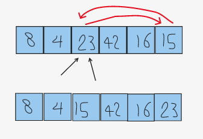
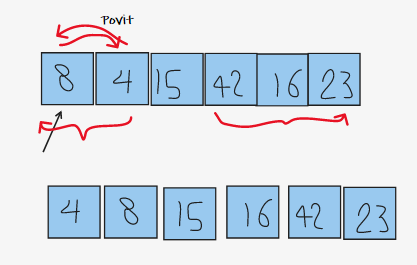
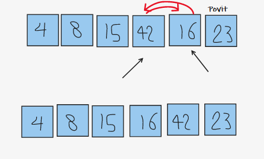
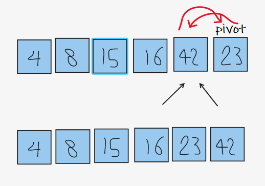

# quick Sort

QuickSort algorithm picks an element as pivot and partitions the given array around the picked pivot. There are many different versions of quickSort that pick pivot in different ways.

- Always pick first element as pivot.
- Always pick last element as pivot.
- Pick a random element as pivot.
- Pick median as pivot.

The key process in quickSort is `partition()`. Target of partitions is, given an array and an element x of array as pivot, put x at its correct position in sorted array and put all smaller elements (smaller than x) before x, and put all greater elements (greater than x) after x. All this should be done in linear time.

## Pseudocode

```java
ALGORITHM QuickSort(arr, left, right)
    if left < right
        // Partition the array by setting the position of the pivot value
        DEFINE position <-- Partition(arr, left, right)
        // Sort the left
        QuickSort(arr, left, position - 1)
        // Sort the right
        QuickSort(arr, position + 1, right)
ALGORITHM Partition(arr, left, right)
    // set a pivot value as a point of reference
    DEFINE pivot <-- arr[right]
    // create a variable to track the largest index of numbers lower than the defined pivot
    DEFINE low <-- left - 1
    for i <- left to right do
        if arr[i] <= pivot
            low++
            Swap(arr, i, low)
     // place the value of the pivot location in the middle.
     // all numbers smaller than the pivot are on the left, larger on the right.
     Swap(arr, right, low + 1)
    // return the pivot index point
     return low + 1
ALGORITHM Swap(arr, i, low)
    DEFINE temp;
    temp <-- arr[i]
    arr[i] <-- arr[low]
    arr[low] <-- temp
```

## Trace

Sample Array: [8,4,23,42,16,15]

### **First part**

To sort this array using quick sort we will go through these steps shown in the images.
the pivot will be 15 and left point on [8] and right point on [16] so the right must be less than pivot and the left is greater but in our case the condtion not happen so we make left point on [4] and right point on [42] agin the condtion is false so the poth pointers point on [23] so we swap our pivot [15] with [23].

[8,4,15,42,16,23]



### **Second part**

we know that [15] is in the right place so we have left part before[15]and right part after [15] ,lets move to left part and choose [4] as pivot so [8] is greater than pivot so we can swap them.
[4,8] to get [4,8,15,42,16,23]



### **Third part**

after sorting the left part we move to the right part which [42,16,23] ,lets make [23] as pivot so right point on [16] and left point on [42] so the condtion is right so we swap between them to get [16,42,23]



### **Forth part**

now we got [16,42,23] and our pivot is [23] so the left pointer will be on 16 and the right point on [42] which is greater so the right pointer will not move and the left will move and point on [42] so  we got to pointers on [42] so we need to swap our pivot with [42] we get [16,23,42] and the left side is sortedas well the whole array.



we will get the sorted array, return it.

## Efficency

- **Time: `O(nlog(n))`:**

- **Space: `O(log(n))`:**