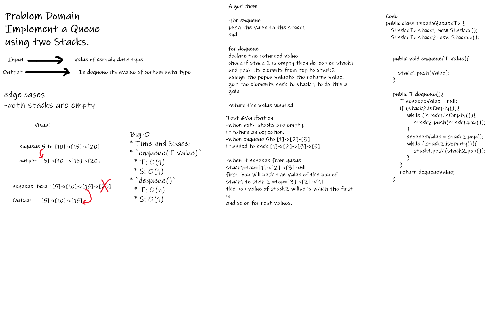
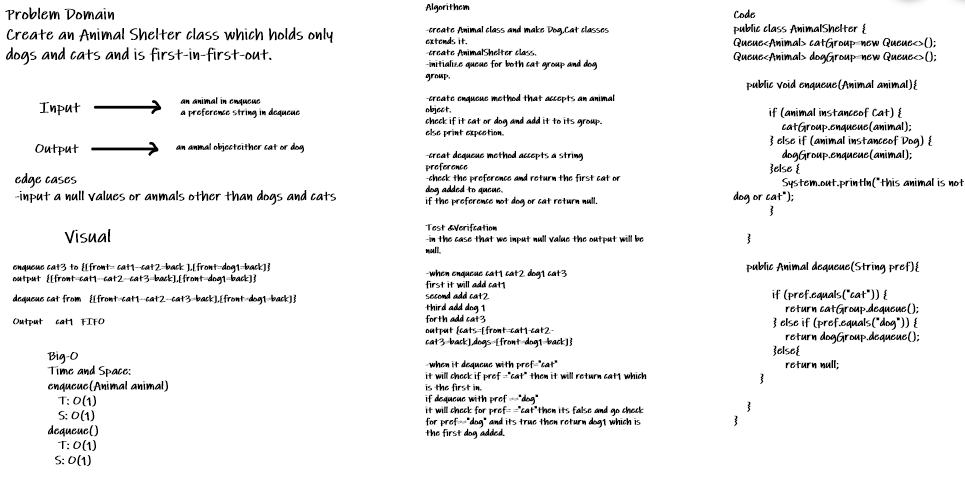
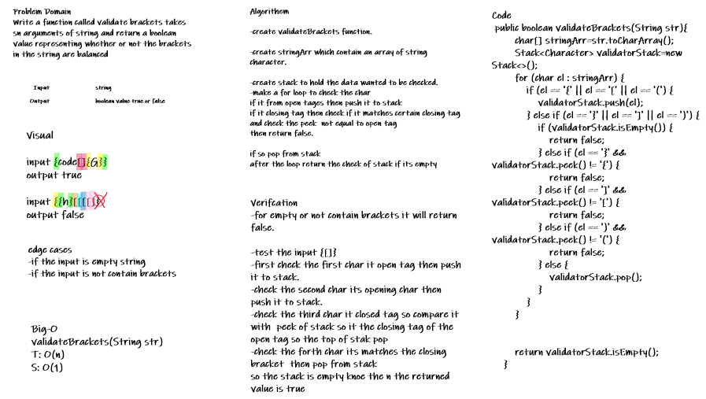

# Stacks and Queues
<!-- Short summary or background information -->

## What is a Stack

A stack is a data structure that consists of Nodes. Each Node references the next Node in the stack, but does not reference its previous.

### Common terminology for a stack is

1. Push - Nodes or items that are put into the stack are pushed
2. Pop - Nodes or items that are removed from the stack are popped. When you attempt to pop an empty stack an exception will be raised.
3. Top - This is the top of the stack.
4. Peek - When you peek you will view the value of the top Node in the stack. When you attempt to peek an empty stack an exception will be raised.
5. IsEmpty - returns true when stack is empty otherwise returns false.

## What is a Queue

A queue is a lot like a stack. It is a linear structure (FIFO) order, but they differ in how elements are removed. Queues are open from both ends.

### Common terminology for a queue is

1. Enqueue - Nodes or items that are added to the queue.
2. Dequeue - Nodes or items that are removed from the queue. If called when the queue is empty an exception will be raised.
3. Front - This is the front/first Node of the queue.
4. Rear - This is the rear/last Node of the queue.
5. Peek - When you peek you will view the value of the front Node in the queue. If called when the queue is empty an exception will be raised.
6. IsEmpty - returns true when queue is empty otherwise returns false.

## Code Challenge 10
<!-- Description of the challenge -->
## My partner in this code challenge **Tamara Bassam**

Using a Linked List as the underlying data storage mechanism, implement both a Stack and a Queue.

## Approach & Efficiency
<!-- What approach did you take? Why? What is the Big O space/time for this approach? -->
I used if statments and try-catch to raise exception and wihle loop to shape the toString method.

-The time and space Efficiency for these approachs is O(1),but the toString method
takes O(n).

## API
<!-- Description of each method publicly available to your Stack and Queue-->

### Stack Methods

push():adds a new node with that value to the top of the stack with an O(1) Time performance.

pop(): Removes the node from the top of the stack Should raise exception when called on empty stack peek, Returns the value from node from the top of the stack.

peek(): Returns Value of the node located at the top of the stack. Should raise exception when called on empty stack.

is empty(): Returns Boolean indicating whether or not the stack is empty.

### Queue Methods

enqueue():adds a new node with that value to the back of the queue with an O(1) Time performance.

dequeue(): Removes the node from the front of the queue. Should raise exception when called on empty queue. Returns: the value from node from the front of the queue.

peek(): Returns Value of the node located at the top of the queue. Should raise exception when called on empty queue.

is empty(): Returns Boolean indicating whether or not the queue is empty.

## Code Challenge 11 Summary

<!-- Description of the challenge -->
Create a class Pseudoqueue which utilizes two stacks and has the methods enqueue(T value) and dequeue() and acts in the same way as the Class Queue.

### Whiteboard Process
<!-- Embedded whiteboard image -->

### Code Challenge 11 Approach & Efficiency
<!-- What approach did you take? Why? What is the Big O space/time for this approach? -->
Approach:
Utilize the methods push, pop, and peek to move the data between the two stacks to emulate a queue. The enqueue will be a simple push into stack1 to create a structure for holding the data. The dequeue will utilze two while loops - the first will pop the data from stack1 into stack2 - this will set the data up to look like a queue (where top is front) and then assign a response value to stack2.pop(). The second while loop will then push the values back into stack1 so new values can use the enqueue to be added to the back of the queue.

* Time and Space:
* `enqueue(T value)`
  * T: O(1)
  * S: O(1)
* `dequeue()`
  * T: O(n)
  * S: O(1)

## Code Challenge 12 Summary

<!-- Description of the challenge -->
Create a Class AnimalShelter that has the methods enqueue(AdoptableAnimal animal) and dequeue(String animalPreference) which holds only Dog and Cat and acts in a first-in-first-out approach.

### Whiteboard Process for this challenge
<!-- Embedded whiteboard image -->

### Code Challenge 12 Approach & Efficiency
<!-- What approach did you take? Why? What is the Big O space/time for this approach? -->
Approach:
Utilize the methods from the Queue class to enable use of the prebuild enqueue(T value) and dequeue() methods. Also utilize the class Animal and classes Dog and Cat to create the structure to hold the correct animal objects in AnimalShelter class.

* Time and Space:
* `enqueue(T value)`
  * T: O(1)
  * S: O(1)
* `dequeue()`
  * T: O(1)
  * S: O(1)

## Code Challenge 13 Summary

<!-- Description of the challenge -->
Write a function called validate brackets takes sn arguments of string and return a boolean value representing whether or not the brackets in the string are balanced

### Whiteboard for this challenge
<!-- Embedded whiteboard image -->

### Code Challenge 13 Approach & Efficiency
<!-- What approach did you take? Why? What is the Big O space/time for this approach? -->
Utilize a stack. Go character by character through the string, when hit an opening bracket push it into the stack. When hit a closing bracket check if it's opening partner matches the peek value of the stack top - if yes, pop the bracket, else return false.
if stack is empty return true, else return false;

* Time and Space:
* `validateBrackets(String str)`
  * T: O(n)
  * S: O(1)
