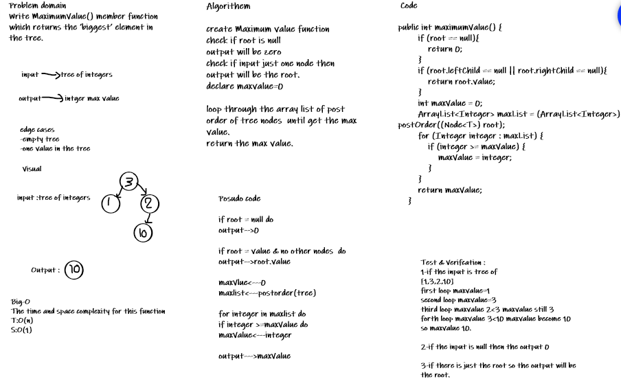

# Trees
<!-- Short summary or background information -->
A Tree is a non-linear data structure where data objects are organized in terms of hierarchical relationship.

## Important Terminology in trees

1. Node - A Tree node is a component which may contain it’s own values, and references to other nodes
2. Root - The root is the node at the beginning of the tree
3. K - A number that specifies the maximum number of children any node may have in a k-ary tree. In a binary tree, k = 2.
4. Left - A reference to one child node, in a binary tree
5. Right - A reference to the other child node, in a binary tree
6. Edge - The edge in a tree is the link between a parent and child node
7. Leaf - A leaf is a node that does not have any children
8. Height - The height of a tree is the number of edges from the root to the furthest leaf

## Challenge
<!-- Description of the challenge -->
### Code Challenge 15

Implement the BinaryTrees and BinarySearchTree.

## Approach & Efficiency
<!-- What approach did you take? Why? What is the Big O space/time for this approach? -->
In add method I used while loop to add the value in its right place.this is good approch to be used.

add():

Time : O(n).

Space : O(n).

In contains method I use a while loop as well to traverse through the tree to find the element.this is agood approch to be used.

contains():

Time : O(n) in the worst case.

Space : O(1).

### Code Challenge 16

Find the maximum value in a given tree.

## Approach & Efficiency (16)
<!-- What approach did you take? Why? What is the Big O space/time for this approach? -->
In add method I used for loop to find the  max value .this is good approch to be used.

add():

Time : O(n).

Space : O(1).

## API
<!-- Description of each method publicly available in each of your trees -->
### Code Challenge (15)

#### Classes and Methods

* `Class:Node`

* `Class:Binary Tree`
* `Methods`
  * pre order
  * in order
  * post order

* `Class:Binary Search Tree`
  * add(Integer value)
  * contains(Integer value)

### Code Challenge (16)

#### Classes and Methods(16)

* `maximumValue()`

## Whiteboard Process
<!-- Embedded whiteboard image -->

